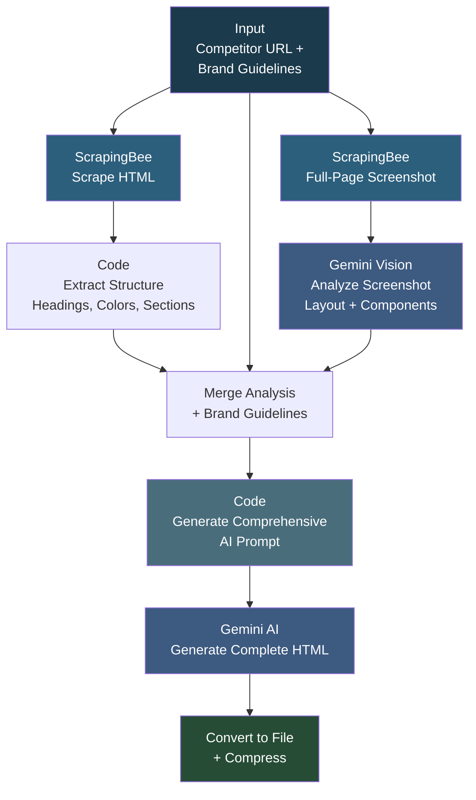

# Landing Page Builder

## Overview

This workflow generates production-ready landing pages by analyzing a competitor's website and applying your own brand guidelines. It scrapes the competitor page (both HTML and a full-page screenshot), uses AI to analyze the structure, layout, and components, then generates a complete HTML landing page that mirrors the competitor's section flow while using your brand's colors, fonts, and design system. The result is a responsive, single-file HTML page ready to deploy. It supports multiple approaches: HTML scraping analysis, screenshot-based visual analysis, or a combined approach with form-based input.

## How It Works

```
Set Competitor URL + Brand Guidelines -> Scrape competitor page (HTML + screenshot) -> Analyze HTML structure (headings, sections, colors) -> Analyze screenshot with Gemini Vision -> Merge analysis + brand guidelines -> Generate comprehensive AI prompt -> Gemini AI generates complete HTML -> Convert to file -> Compress for deployment
```

### Workflow Diagram



## Integrations

- **ScrapingBee** - Website scraping (HTML and full-page screenshots with JS rendering)
- **Google Gemini** - Visual page analysis and HTML code generation
- **Netlify** - Optional deployment endpoint for generated pages

## Setup

1. Import `Landing_Page_Builder.json` into your n8n instance.
2. Configure credentials for Google Gemini (PaLM API).
3. Update the ScrapingBee API key in the HTTP Request nodes.
4. Customize the brand guidelines JSON in the "Set Brand Guidelines" node with your company's colors, fonts, spacing, and messaging.
5. Set the competitor URL to analyze.
6. Optionally configure the Netlify API token for automatic deployment.
7. Execute the workflow manually or use the form trigger.
